# Module 2: Migrate MongoDB Applications to Azure Cosmos DB(Mongo API)
## Scenario 1: Understand the Flight Reservation App, Local MongoDB and test Application
### Understand Flight reservation application 
#### Access Jump VM 
1. From azure portal, go to virtual machine and select the JumpVM. In Overview section, click on **Connect** button. It will show username with IP address copy that IP address.<br/>
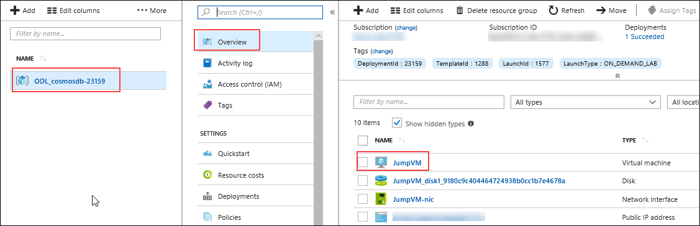<br/>
1. Click on start button and search for **Remote Desktop Connection** and click on it.<br/>
1. Remote Desktop Connection window will pop-up in that provide the IP Address that you copied in above step.<br/>
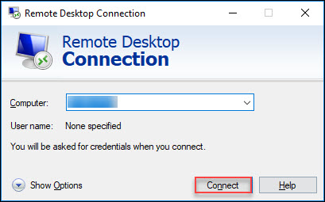<br/>
1. Click on **Yes** button in Remote Desktop Connection Wizard.<br/>
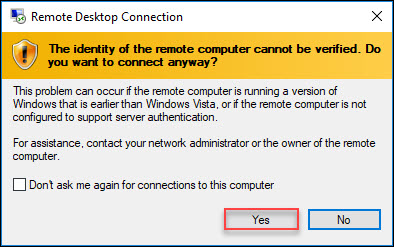<br/>
1. Enter the credentials provided in the mail to connect to VM.<br/>
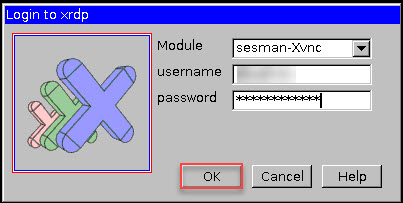<br/>

    > Note If you get err:connecting at first login: Click OK and try again.

#### Launch VS Code and understand application components and hierarchy 

1. Once you are logged in the Ubuntu OS click on Application for accessing visual studio code as shown blow.<br/>
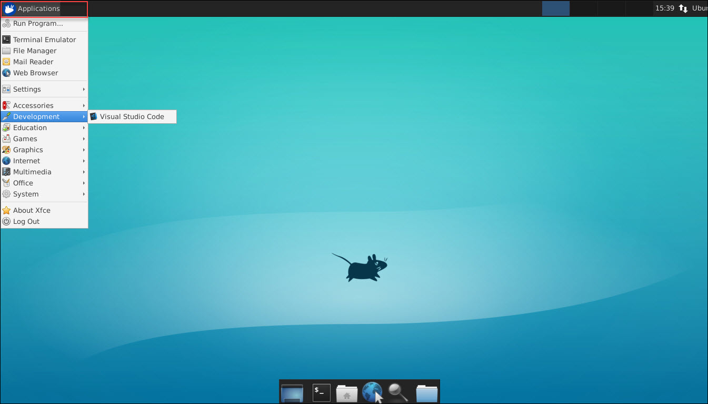<br/>
1. VS Code should have src folder already opened, Notice the folders hierarchy<br/>
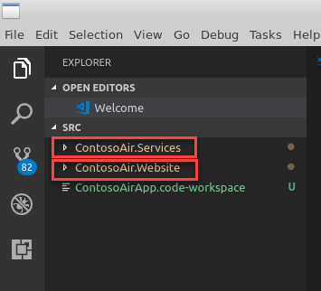<br/>
1. ContosoAir application is 3-tiered application, One frontend application built on AngularJS named **ContosoAir.Website** and API application named **ContosoAir.Services** build with NodeJS and a data backend running on MongoDB.<br/>
1. All connectivity information required for the API application is maintained in **config.js**, As shown below.<br/>
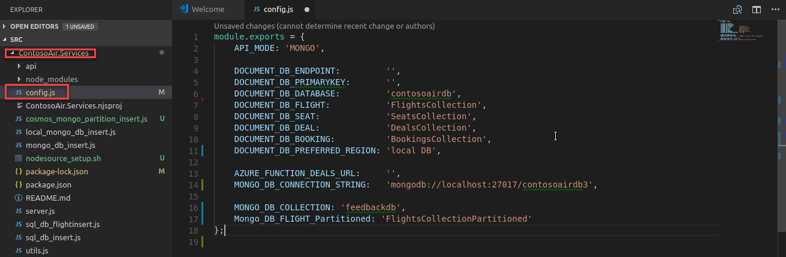<br/>
1. Following is the file system location for application binaries /home/CosmosDB-Hackfest/ContosoAir/src/.<br/>
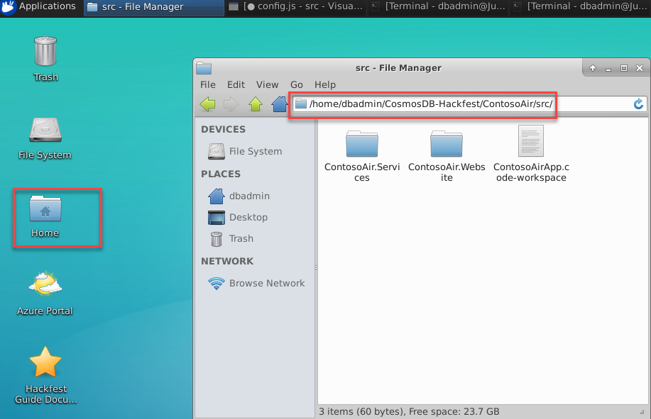<br/>
#### Access Local MongoDB and Verify Collections

1. Open the **Terminal**, then start the mongodb Service by running **sudo service mongod start** and  verify the mongoDB database while running the **mongo** as shown below.<br/>
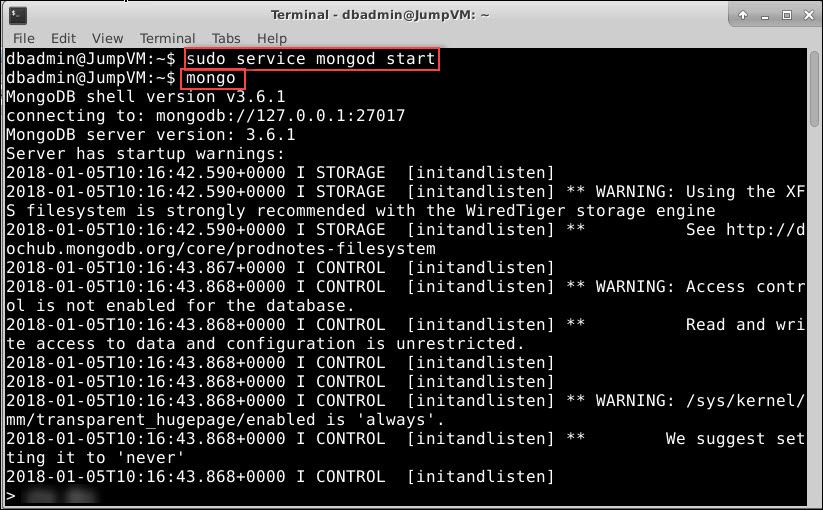<br/>
1. You can also verify the records in mongoDB database while running the following commands. Copy the db_name(contosoairdb3) for future use. Note down that there are 5 collections used by the Application.<br/>
```bash
show dbs 
use <db_name>
show collections
```
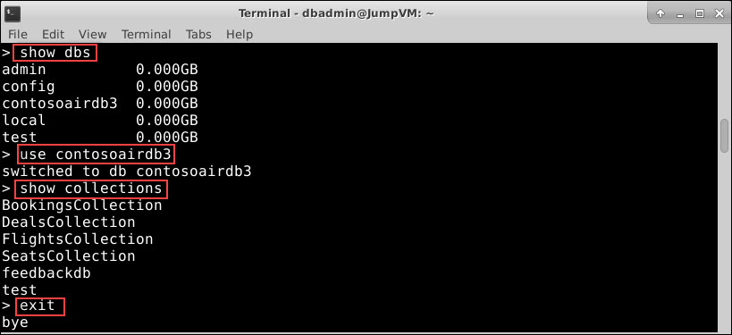<br/>

#### Execute and Test the Application Locally

1. To start the ContosoAir app service layer, go to /home/CosmosDB-Hackfest/ContosoAir/src/ContosoAir.Services in file system, right click and select **Open Terimal Here** as shown below.<br/>
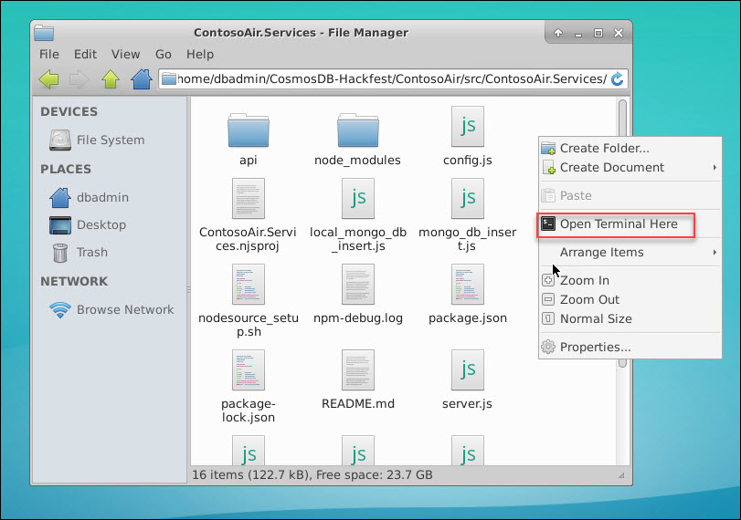<br/>
1. **Open** the **Terminal** and run **npm start** command. Application should start, Incase of any errors make sure you're in right directory as instructed in previous step. Minimize the terminal once command is executed, do not exit or CTRL+C.<br/>
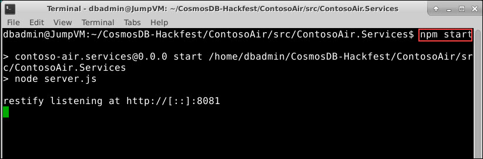<br/>
1. Now, to start the ContosoAir Website layer, go to **/home/CosmosDB-Hackfest/ContosoAir/src/ContosoAir.Website**. Open terminal from there and run **ng serve** command in terminal. Minimize the terminal once command is executed, do not exit or CTRL+C.<br/>
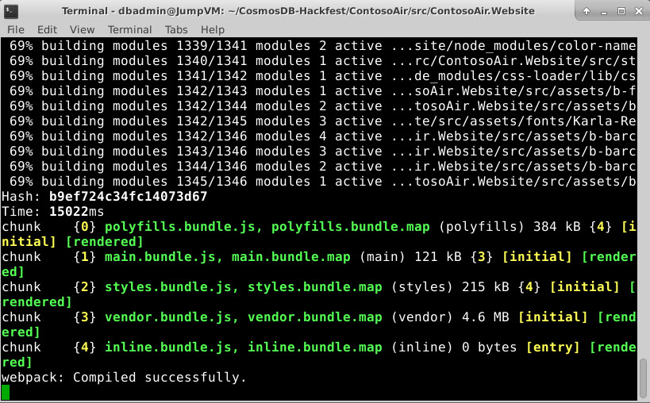<br/>

    > Note This  may take upto a minute to start this website. 

1. Copy **localhost URL** [http://localhost:4200](http://localhost:4200) from **here** and paste it in **Web Browser** browser and press enter. There's a shortcut created for your already on desktop for this, you can open website using that as well.<br/>
1. You will see the sign-up page. You need to login to App using your Microsoft Account(formerly live-id). If you do not have a live-id, you can create one by following instructions given on page.<br/>
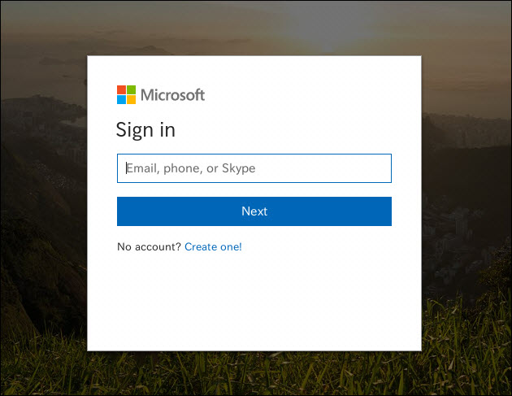<br/>
1. Once you get login, you will be redirected to **ContosoAir app**.<br/>
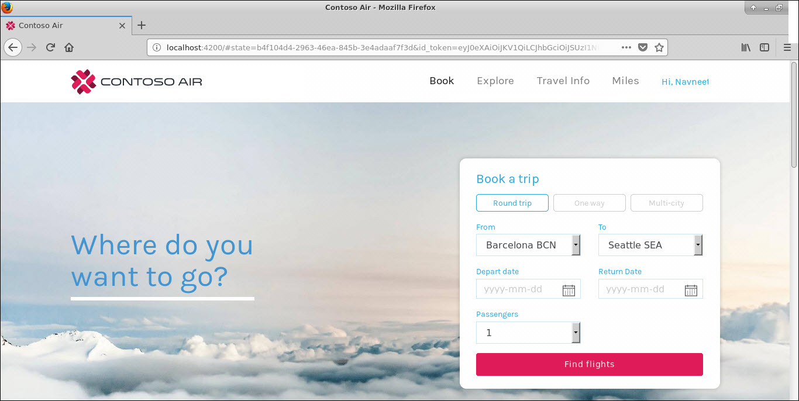<br/>
1. Enter **Departure date** and **Return date** in **YYYY-MM-DD** format and click **Find Flights** button.<br/>
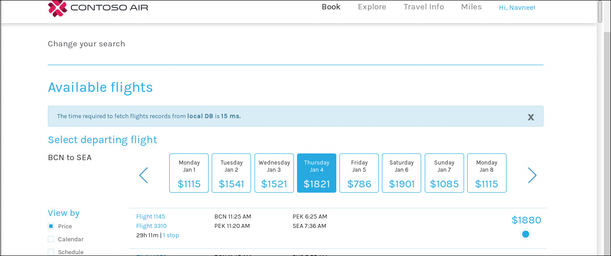<br/>
 
## Scenario 2: Migrate Application data to Cosmos DB

### Create Cosmos DB with Mongo API
1. Open **Azure Portal** with your credential, open the resource group which is already created and click on **Add** button.<br/>
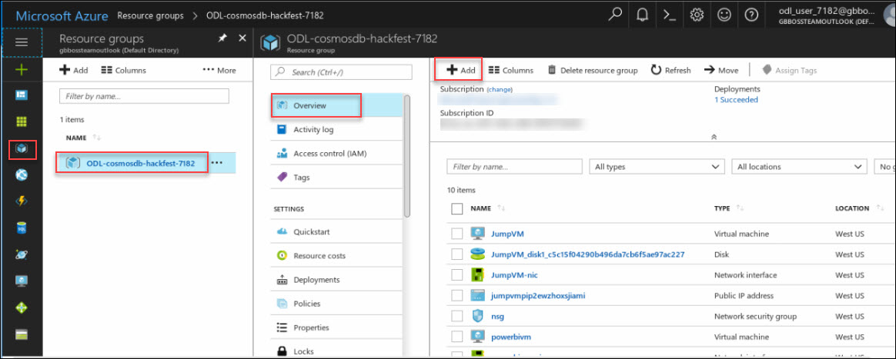<br/>
1. Search for Azure Cosmos DB and Select it from results.<br/>
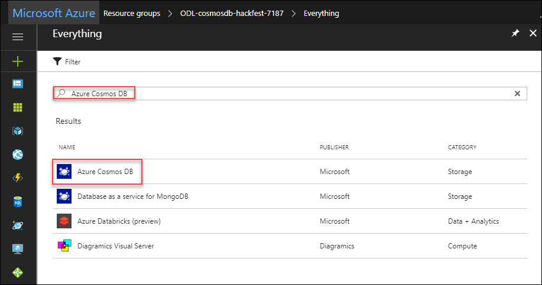<br/>
1. Click on **Create** button.<br/>
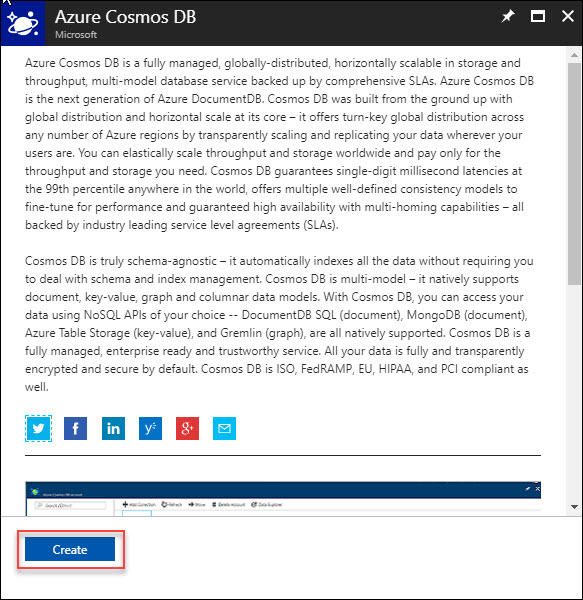<br/>
1. Populate the below parameters as shown below.<br/>
* **ID**:(any valid name)
* **API**: select **Mongo DB** from the dropdown.
* **Resource Group**: Choose **use existing** Resource Group.<br/>
 Click on **Create**.<br/>
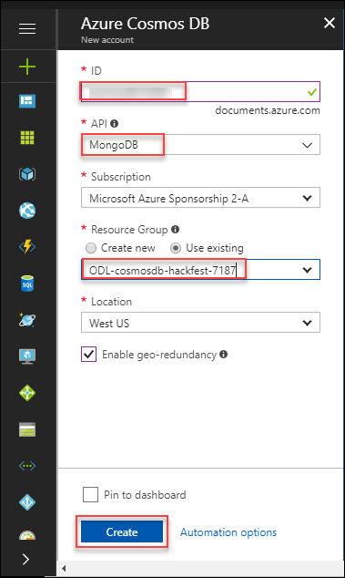<br/>
5. After deployment gets completed, click on **Go to resource** to verify that resource is successfully deployed.<br/>
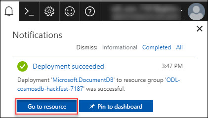<br/>
6. **Go to Connection String** and Copy all the parameters (Host, Port, Username, Password, Primary Connection String) in notepad for future use.<br/>
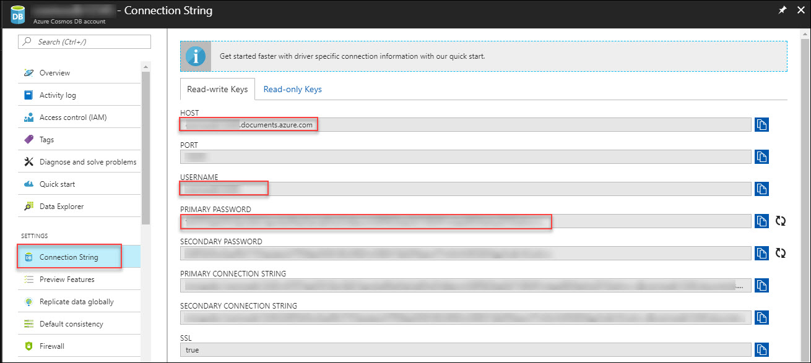<br/>
### Migrate Database to Azure Cosmos DB
In this exercise, We will use mongoexport to export the data from MongoDB running locally in the jump-VM and then we will use mongoimport to insert this dataset into newly created Cosmos DB.<br/>
1. Open **Terminal** on Jump VM in which you run the **mongo** command, (Alternatively you can also access Jump VM on SSH by any ssh tool such as Putty), for verifying the MongoD Service is running. Issue following commands to export the each collection in the mongo db database to a local bkp file.<br/>

```bash
sudo mongoexport --host localhost --db contosoairdb3 --collection BookingsCollection --out BookingsCollection.bkp
sudo mongoexport --host localhost --db contosoairdb3 --collection DealsCollection --out DealsCollection.bkp
sudo mongoexport --host localhost --db contosoairdb3 --collection FlightsCollection --out FlightsCollection.bkp
sudo mongoexport --host localhost --db contosoairdb3 --collection SeatsCollection --out SeatsCollection.bkp
sudo mongoexport --host localhost --db contosoairdb3 --collection feedbackdb --out feedbackdb.bkp
```
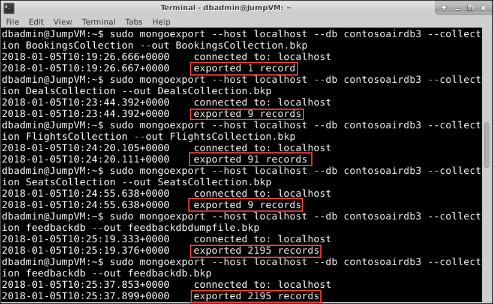<br/>

2.  Now, we will import this MongoDB on Azure Cosmos DB (MongoDB) and replace the **HOST, PORT, USERNAME** and **PASSWORD** with the parameters in below command with values you copied in above step.<br/>

```bash
mongoimport --host <HOST>:<PORT> -u <USERNAME> -p <PASSWORD> --ssl --sslAllowInvalidCertificates --db contosoairdb3 --collection BookingsCollection --file BookingsCollection.bkp

mongoimport --host <HOST>:<PORT> -u <USERNAME> -p <PASSWORD> --ssl --sslAllowInvalidCertificates --db contosoairdb3 --collection DealsCollection --file DealsCollection.bkp

mongoimport --host <HOST>:<PORT> -u <USERNAME> -p <PASSWORD> --ssl --sslAllowInvalidCertificates --db contosoairdb3 --collection FlightsCollection --file FlightsCollection.bkp

mongoimport --host <HOST>:<PORT> -u <USERNAME> -p <PASSWORD> --ssl --sslAllowInvalidCertificates --db contosoairdb3 --collection SeatsCollection --file SeatsCollection.bkp

mongoimport --host <HOST>:<PORT> -u <USERNAME> -p <PASSWORD> --ssl --sslAllowInvalidCertificates --db contosoairdb3 --collection feedbackdb --file feedbackdb.bkp
```
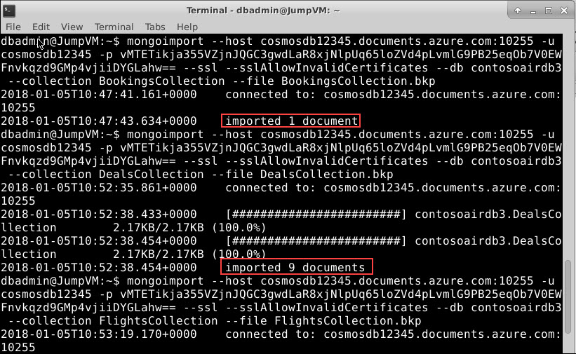<br/>

3.  Data is now migrated, lets verify this in Azure Portal, switch to Azure Portal as launched earlier navigate to Resource groups option present in the favourites menu on the left side panel and select the **Resource Group** then click on your newly created **Azure Cosmos DB Account**.<br/>

4. Click on **Data Explorer** option. It will display the collection created in Azure Cosmos DB Account. You should see newly created DB along with collection, you may browse the documents in collections.<br/>
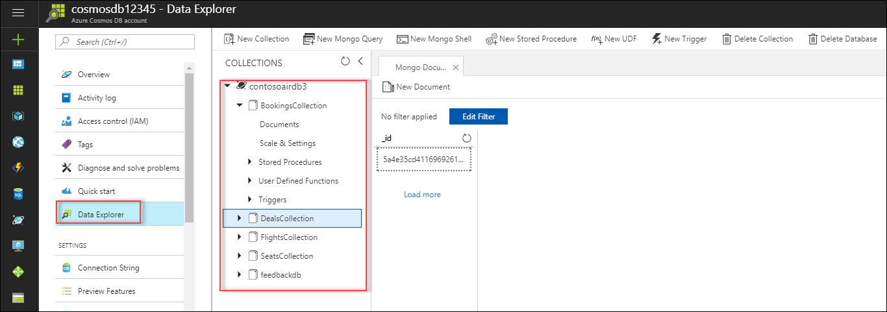<br/>

### Update Application to use Cosmos DB 

1. Go back to Visual Studio Code IDE in JumpVM and navigate to the config.js file under ContosoAir.Services and paste the **HOST** value against **DOCUMENT_DB_ENDPOINT**, **PRIMARY KEY** against **DOCUMENT_DB_PRIMARYKEY**, **DOCUMENT_DB_DATABASE** as **contosoairdb3** and **Primary Connection String** Against **MONGO_DB_CONNECTION_STRING** and add database name (contosoairdb3) before question mark in connection string.
it should look something like below:

```bash
mongodb://cosmosdb12345:vMTETikja355VZjnJQGC3gwdLaR8xjNlpUq65loZVd4pLvmlG9PB25eqOb7V0EWFnvkqzd9GMp4vjiiDYGLahw==@cosmosdb12345.documents.azure.com:10255/*contosoairdb3*?ssl=true&replicaSet=globaldb
```

2. Navigate back to the **Azure Portal** Resource groups option present in the favourites menu on the left side panel and select the **Resource Group** and click on **Azure Cosmos DB Account** then, click on **Replicate data globally** option present under **SETTINGS** section in Cosmos DB Account blade.<br/>

3. Copy the **WRITE REGION** and paste it against **DOCUMENT_DB_PREFERRED_REGION** key in **config.js** file which is already opened in Visual Studio Code IDE and save this file.<br/>
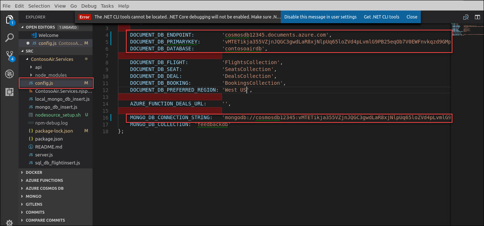<br/>

4. Open the terminal window already running with **npm start** for Services application, Exit the application by pressing CTRL+C and start the application again by running **npm start**.<br/>
<br/>
<br/>

5. ContosoAir Website should be running already in other terminal window, You can leave it running(No need to stop and restart).
if not running, you can manually start it to by going to **/home/CosmosDB-Hackfest/ContosoAir/src/ContosoAir.Website**. Open terminal from there and run **ng serve** command in terminal.<br/>
<br/>
6. Copy the **localhost URL** [http://localhost:4200](http://localhost:4200) from the **here** and paste it in **Mozilla firefox** browser and press enter.<br/>

7. You will see the sign-up page if you already sign-up it will redirect to **ContosoAir app**. Enter your microsoft Credential here.<br/>
<br/>
8. Once you get login, you will be redirected to **ContosoAir app**.<br/>
<br/>
9. Enter **Departure date** and **Return date** in **YYYY-MM-DD** format and click **Find Flights** button.<br/>
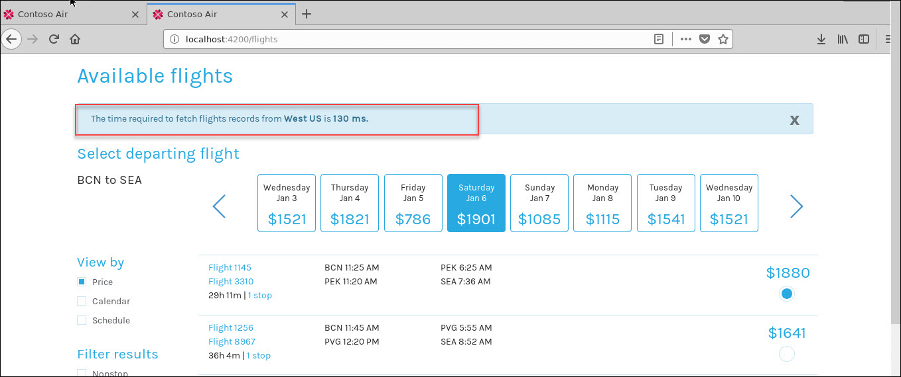<br/>

You should notice that latency is now changed when loading the flight data

   > _Awesome, you have migrated your application database from local MongoDB instance to Azure Cosmos DB and your application is now using Cosmos DB.


# Cosmos DB Concepts

## Scenario 3: Partitioning

## Concept of Logical Partitioning

1. In **Azure Cosmos DB**, you can store and query schema-less data with order-of-millisecond response times at any scale.
1. Azure Cosmos DB provides **containers** for storing data called **collection.** **Containers** are logical resources and can span one or more physical partitions or servers.
1. The number of partitions is determined by Azure Cosmos DB based on the **storage** **size** and the provisioned **throughput** of the container. 
1. Partition management is fully managed by **Azure Cosmos DB**, and you don't have to write complex code or manage your partitions. **Azure Cosmos DB** containers are unlimited in terms of **storage** and **throughput.**
1. When you create a collection, you can specify a  **partition key** property. **Partition key** is the JSON property (or path) within your documents that can be used by **Mongo API** to distribute data among multiple partitions.
1. **Mongo API** will hash the partition key value and use the hashed result to determine the partition in which the JSON document will be stored. All documents with the same partition key will be stored in the same partition.

   >_In_ **Azure Cosmos DB,** logical partitioning _gets created based on the_ **size** _of the collection i.e. more than_ **10 GB** _or the specified **throughput of the container** (throughput in terms of [request units_](https://docs.microsoft.com/en-us/azure/cosmos-db/request-units) (RU) per second)._

   >_Physical partitioning_ **Partitioning** _is completely managed by_ **Azure**_. It automatically creates a_ **Logical Partition** _based on the_ **Partition key**. But in this case, just to show you the power of **Partitioning** feature of Azure Cosmos DB, we have created the **Physical partition.** 

**Configure FlightsCollection data to leverage the Partitions**

1. In this exercise, we'll create another collection named **FlightsCollectionPartitioned** in existing **contosoairdb3** with number of **Stops** as the partition key.
1. Open Azure Portal and access the Cosmos DB account created earlier, Go to **Browse** in settings blade.

    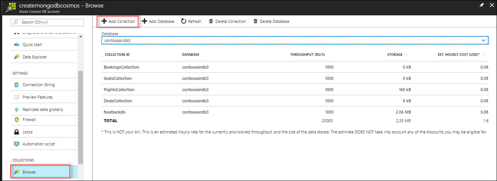

1. Click on **Add Collection** Button, Scroll horizontally to see the full dialogue box. Enter **contosoairdb3** as the **Database Id** and **FlightsCollectionPartitioned** as **collection Id**. Enter **stop** as **Shared key**, leave all other settings as default.

   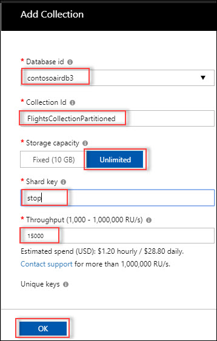

4. In order to use this collection in the application, we need to edit **config.js** of Services application and replace following value with newly created collection. Save the file once changed.<br/>
    **DOCUMENT_DB_FLIGHT**           'FlightsCollection',
replace with newly created collection with partitioning 
   **DOCUMENT_DB_FLIGHT**:           'FlightsCollectionPartitioned',
   
    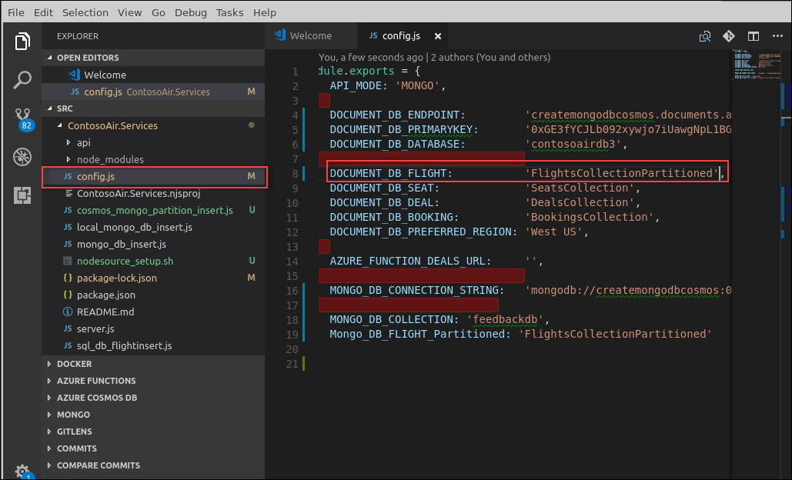

5. Now we'll insert the the **FlightsCollection** data into this partitioned collection. For this, we already created a nodejs program named **cosmos_mongo_partition_insert.js** . You can use **ls** to verify the files in the directory. In ContosoAir.Services root directory open the **Terminal** and run the **node cosmos_mongo_partition_insert.js** command. 

    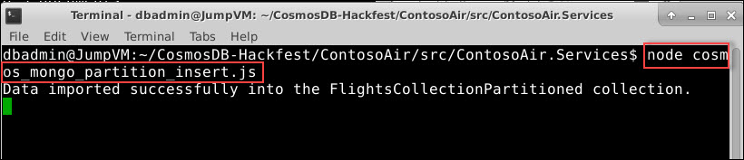
 
6. Data is now inserted, let's go to Azure portal to verify, Go to **Browse** in settings blade of Cosmos DB Account.

7. You'll see that under documents, there's another column named **stop** along with **id**. Click on **Scale and settings** to verify the partition. 

    
  
8. In order to test the application, exit the terminal running **npm start** for the application and start it again.

> Awesome! In this scenario, you learned the Partitioning feature of  Azure Cosmos DB.

## Scenario 4: Global Distribution


 > Replication protects your data and preserves your application up-time in the event of transient hardware failures. If your data is replicated to a second data center, it's protected from a catastrophic failure in the primary location.

   > Replication ensures that your storage account meets the  [Service-Level Agreement (SLA) for Storage](https://azure.microsoft.com/support/legal/sla/storage) even in the face of failures. See the SLA for information about Azure Storage guarantees for durability and availability.

   > _To test the above scenario, _lets replicate the database into multiple regions. Below is the procedure for the same._
   
### Replicate data globally   
1.  **Launch** a browser and **navigate** to https://portal.azure.com. **Login** with your Microsoft Azure credentials.<br/>
2.  Select the **Azure Cosmos DB account(MongoDB)**.<br/>
3.  In the Cosmos DB account page click on **Replicate data globally** tab under the **Settings** tile.<br/> 
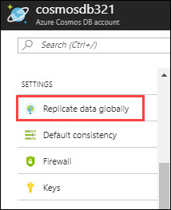<br/>
4.  In the new page that appear, click on **Add new region** under **Read regions**.<br/>
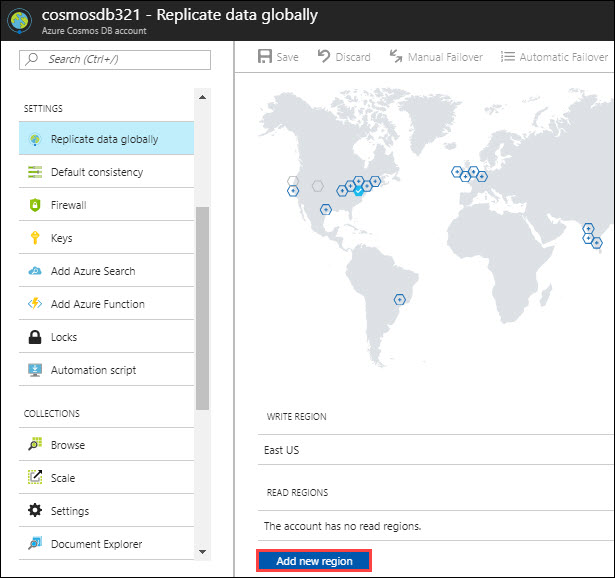<br/> 

 > For experiencing the Latency difference, replicate Azure Cosmos DB
   > - Near to your current location (Low Latency).
   > - Far away from your current location (High Latency).
   
      > - You can distribute your data to any number of Azure regions, with the click of a button. This enables you to put your data where your users are, ensuring the lowest possible latency to your customers.  

5.  If you want to add more regions, click on **Add new region** again and select the required region and click on **Save**.
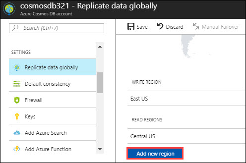<br/>

  > **Note** :
   > - It takes some time near about 8 to 10 mins to complete the deployment of the resources 

### NodeJS Libraries for Geo Replication
CosmosDB with MongoAPI supports same read preference available in NodeJS Mongo libraries. With read preference you can control from where your Reads are happing in a Replicated and from Mongo DB also in a shared. Let’s go through the different types of read Preferences that are available and what they mean.

* **ReadPreference.PRIMARY**: Read from primary only. All operations produce an error (throw an exception where applicable) if primary is unavailable. Cannot be combined with tags (This is the default.)
* **ReadPreference.PRIMARY_PREFERRED**: Read from primary if available, otherwise a secondary.
* **ReadPreference.SECONDARY**: Read from secondary if available, otherwise error.
* **ReadPreference.SECONDARY_PREFERRED**: Read from a secondary if available, otherwise read from the primary.
* **ReadPreference.NEAREST**: All modes read from among the nearest candidates, but unlike other modes, NEAREST will include both the primary and all secondaries in the random selection. The name NEAREST is chosen to emphasize its use, when latency is most important. For I/O-bound users who want to distribute reads across all members evenly regardless of ping time, set secondaryAcceptableLatencyMS very high. See “Ping Times” below. A strategy must be enabled on the ReplSet instance to use NEAREST as it requires intermittent setTimeout events, see Db class documentation.

Additionally you can now use tags with all the read preferences to actively choose specific sets of regions in a globally distributed Cosmos DB. For example, if you wanto use West US as read region, you can specify this tag  { region: ‘West US’, size: ‘large’ } with read preferences.
### Connect Application to Secondary region

Now let's update the application to use secondary region as read region and experience the latency differene used earlier.
1. Access JumpVM and launch **Visual Studio Code** if not running already

1. Update your newly added secondary region in Cosmos DB againt **DOCUMENT_DB_PREFERRED_REGION** in **config.js** in Services project.
   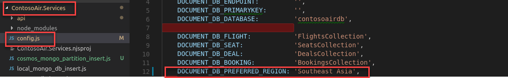<br/>

1. Open **flights.controller.js** file available under **api** >> **flights** folder in the Sevices Project.
  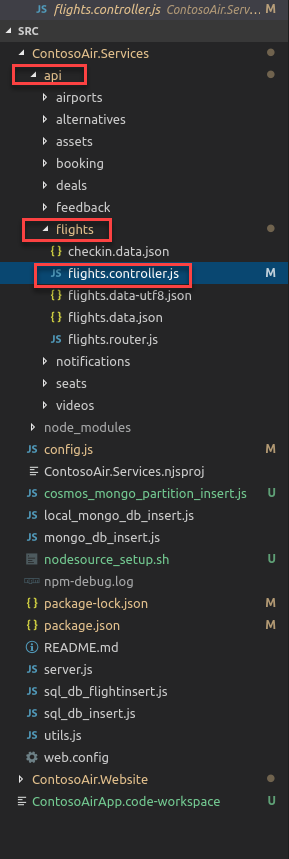<br/>
1. Scroll down and comment the line number 66 by adding **//** in front of line . This will disable default mode of quering  flights data from primary region.
  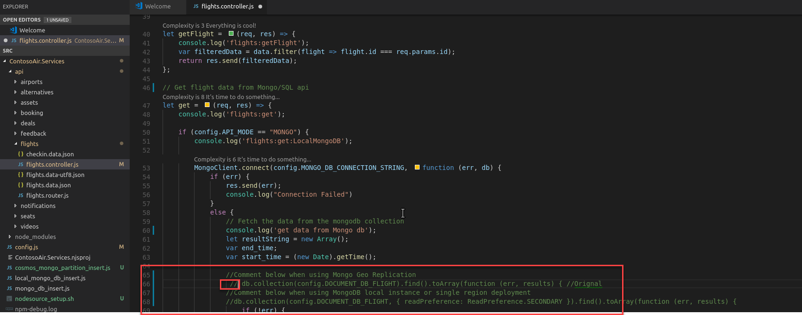<br/>
1. Uncomment line #68 . If you look closely this line is specifying the readpreference to query data against. 
   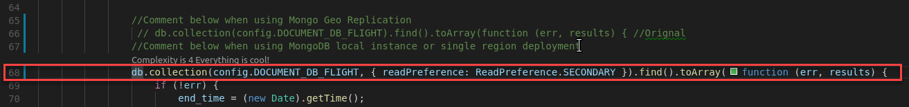<br/>
1. Save both **config.js** and **flights.controller.js** files. 
1. Open the **Terminal** window already running with **npm start** for Services application, Exit the application by pressing CTRL+C and start the application again by running **npm start**.<br/>
   <br/>
   <br/>
1. ContosoAir Website should be running already in other terminal window, you can leave it running(No need to stop and restart).
if not running, you can manually start it to by going to **/home/CosmosDB-Hackfest/ContosoAir/src/ContosoAir.Website**. Open terminal from there and run **ng serve** command in terminal.<br/>
   <br/>
1. Copy the **localhost URL** [http://localhost:4200](http://localhost:4200) from **here** and paste it in **Mozilla firefox** browser and press enter.<br/>
1. If you see login page, Login with your Microsoft account(live-id) or move to next step.<br/>
1. Enter **Departure date** and **Return date** in **YYYY-MM-DD** format and click **Find Flights** button.<br/>
  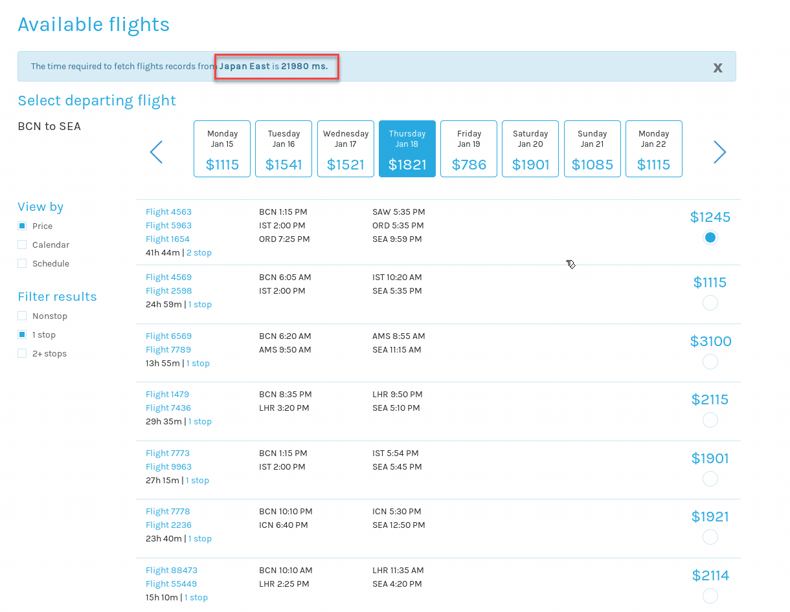<br/>

You should notice that latency is now changed when loading the flight data in comparision to default.

   > _Awesome, you have enable geo-replication on your databases and configured your application to use secondary regions for read operations.

## Scenario 5: Azure Cosmos DB Operations: Monitoring, Security and Backup & Restore

## Understanding Cosmos DB Monitoring and SLA's

Cloud service offering a comprehensive SLA for:

1. **Availability:** The most classical SLA. Your system will be available for more than 99.99% of the time or you get a refund.
1. **Throughput:** At a collection level, the throughput for your database collection is always executed according to the maximum throughput you provisioned.
1. **Latency:** Since speed is important, 99% of your requests will have a latency below 10ms for document read or 15ms for document write operations.
1. **Consistency:** Consistency guarantees in accordance with the consistency levels chosen for your requests.

   >_Now let's walk through different SLA's and see how the data is displayed in graphical format._

1. Click on Azure Portal's **Resource Group** option present in the favourites blade in the left side panel and click on **<inject story-id="story://Content-Private/content/dfd/SP-GDA/gdaexpericence1/story_a_gda_using_cosmosdb" key="myResourceGroupName"/>.**
1. Click on **"<inject story-id="story://Content-Private/content/dfd/SP-GDA/gdaexpericence1/story_a_gda_using_cosmosdb" key="cosmosDBWithSQLDBName"/>"** which is your **Cosmos DB Account** and then click on **Metrics** option present under **Cosmos DB Account** blade.
1. SLA's based on parameters such as **Throughput, Storage, Availability, Latency and Consistency** will be viewed.

   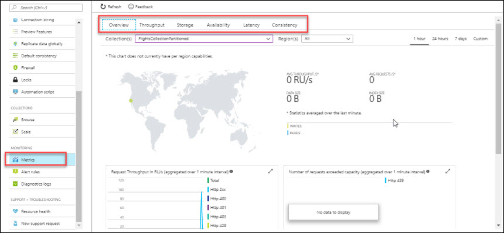<br/>

#### Charts included under Throughput menu

1. Click on **Throughput** menu to view the graphs.
1. The first graph displayed is to find **Number of requests over the 1 hour period.**

   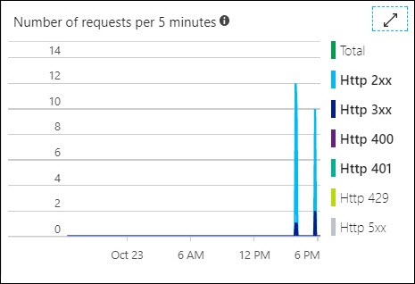

1. The second graph is to monitor **Number of requests that failed due to exceeding throughput or storage capacity provisioned for the collection per 5 min.**
1. The third chart displays **provisioned throughput and Max Request Units per second (RU/s) consumed by a physical partition, over a given 5-minute interval, across all partitions.**

    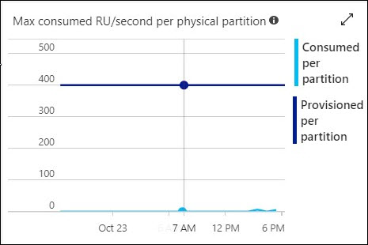<br/>

1. This chart **displays provisioned throughput and Max Request Units per second (RU/s) consumed by each physical partition over the last observed 1-minute interval.**

    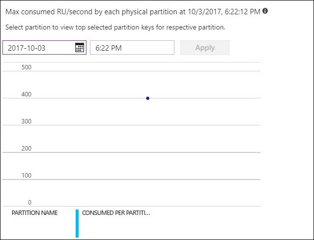<br/>

1. The fourth chart shows the **Average Consumed Request Units per second (RU/s) over the 5-minute period vs provisioned RU/s.**

    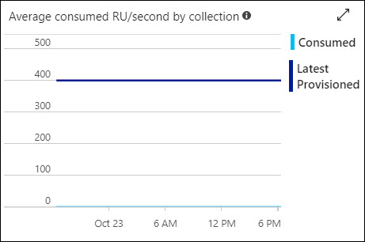<br/>
    
    #### Charts included under Storage menu.

1. Click on **Storage** menu to view the graphs.
1. The first graph displays the **Available storage capacity for this collection, current size of the collection data, and index.**

    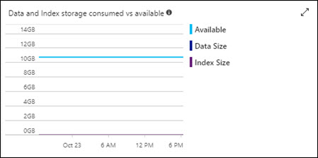<br/>
    
1. Another graph shows the **Current size of data and index stored per physical partition.**

    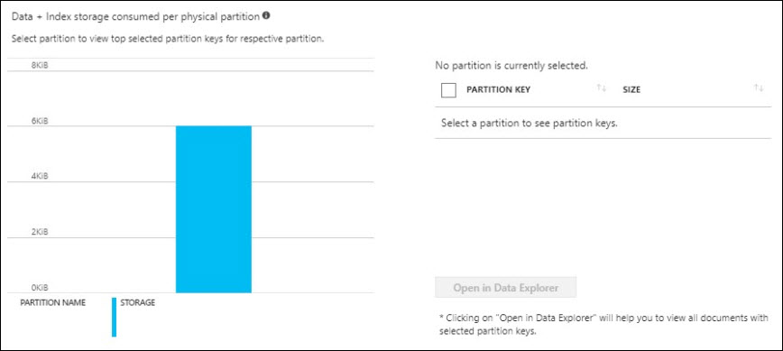<br/>
1. The third chart shows the **Current number of documents stored per physical partition**.

    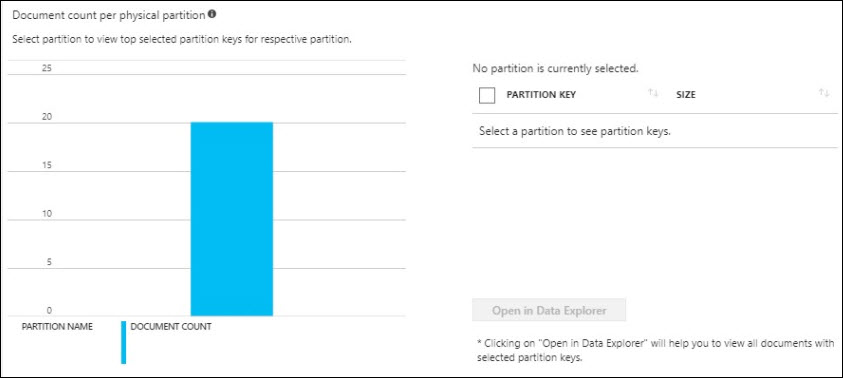<br/>

    #### Charts included under Availability menu.

1. Click on **Availability** menu to view the graphs.
1. The chart displays the **Availability is reported as % of successful request over the past hour, where successful is defined in the DocumentDB SLA.**
    
    #### Charts included under Latency menu.

1. Click on **Latency** menu to view the graphs.
1. First graph displays **the Latency for a 1KB document lookup operation observed in this account's read regions in the 99th percentile.**

    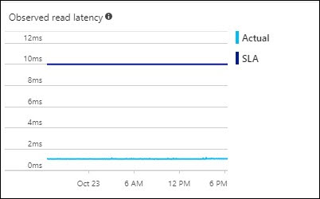<br/>

1. Another graph displays the Latency for a 1KB document write operation observed in South Central US in the 99th percentile.

    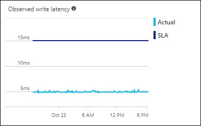<br/>

    #### Charts included under Consistency menu.

1. Click on **Consistency** menu to view the graphs.
1. The first graph displays **Empirical probability of a consistent read in read region as a function of time since the corresponding write commit in write region, observed over the past hour.**

    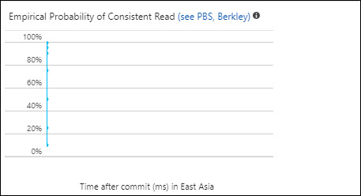<br/>

1. This chart shows **distribution of the observed replication latency in {0}, i.e. the difference between time when the data write was committed in {1} and the time when the data became available for read in {0}.**

    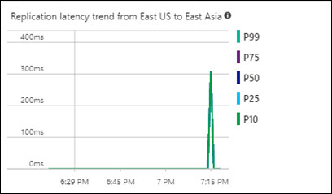<br/>

1. The third graph displays **Percent of requests that met the monotonic read guarantee and the "read your own writes" guarantee.**

    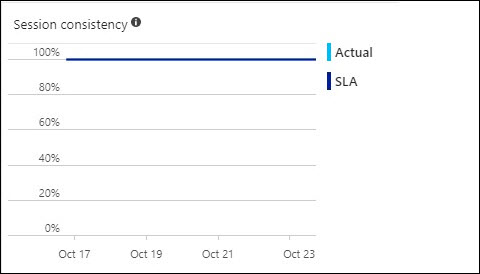<br/>

    > For further information refer following link [Azure Cosmos DB  Service Level Agreements](https://azure.microsoft.com/en-us/support/legal/sla/cosmos-db/v1_1//).

>_Excellent job! Congratulations you successfully deep dived into the features of_ **Azure Cosmos DB** _._

## Securing Cosmos DB with Firewall
To secure data stored in an Azure Cosmos DB database account, Azure Cosmos DB has provided support for a secret based authorization model that utilizes a strong Hash-based message authentication code (HMAC). Now, in addition to the secret based authorization model, Azure Cosmos DB supports policy driven IP-based access controls for inbound firewall support. This model is similar to the firewall rules of a traditional database system and provides an additional level of security to the Azure Cosmos DB database account. With this model, you can now configure an Azure Cosmos DB database account to be accessible only from an approved set of machines and/or cloud services. Access to Azure Cosmos DB resources from these approved sets of machines and services still require the caller to present a valid authorization token.

#### IP Access Control Overview

By default, an Azure Cosmos DB database account is accessible from public internet as long as the request is accompanied by a valid authorization token. To configure IP policy-based access control, the user must provide the set of IP addresses or IP address ranges in CIDR form to be included as the allowed list of client IPs for a given database account. Once this configuration is applied, all requests originating from machines outside this allowed list are blocked by the server. The connection processing flow for the IP-based access control is described in the following diagram:

  
  
 To set the IP access control policy in the Azure portal, navigate to the Azure Cosmos DB account page, click **Firewall** in the navigation menu, then change the Enable IP Access Control value to **ON**. Once IP access control is on, the portal provides switches to enable access to the Azure portal, other Azure services, and the current IP.
    

   
   
As a part of Lab, You may want to restrict access to your Database from the Linux VM where application is running and from Windows VM where PowerBI is running.


## Scale MongoDB Collections in Azure Cosmos DB

Azure Cosmos DB allows you to scale the throughput of a collection by just a couple of clicks.In order to scale up and down the throughput of a Cosmos DB collection, navigate to the Azure Cosmos DB account page and click on Scale.

Here you should see the current throughput and options to increase/decrease the throughput. You can make the necessary changes and Click **Save**.
  
  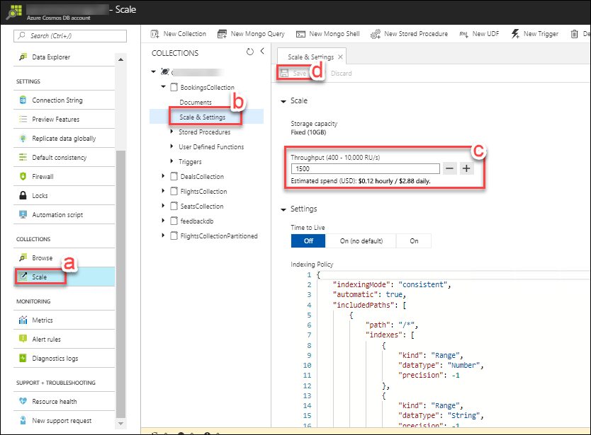
 
 
## Understanding Cosmos DB Backup and restore functionality.

Azure Cosmos DB automatically takes backups of all your data at regular intervals. The automatic backups are taken without affecting the performance or availability of your database operations. All your backups are stored separately in another storage service, and those backups are globally replicated for resiliency against regional disasters. The automatic backups are intended for scenarios when you accidentally delete your Cosmos DB container and later require data recovery or a disaster recovery solution.
These automated backups are currently taken approximately every four hours and latest 2 backups are stored at all times. If the data is accidentally dropped or corrupted, please contact Azure support within eight hours.
Unlike your data that is stored inside Cosmos DB, the automatic backups are stored in Azure Blob Storage service. To guarantee the low latency/efficient upload, the snapshot of your backup is uploaded to an instance of Azure Blob storage in the same region as the current write region of your Cosmos DB database account. For resiliency against regional disaster, each snapshot of your backup data in Azure Blob Storage is again replicated via geo-redundant storage (GRS) to another region

### Backup retention period
As described above, Azure Cosmos DB takes snapshots of your data every four hours at the partition level. At any given time, only the last two snapshots are retained. However, if the collection/database is deleted, we retain the existing snapshots for all of the deleted partitions within the given collection/database for 30 days.

If you want to maintain your own snapshots, you can use the export to JSON option in the Azure Cosmos DB Data Migration tool to schedule additional backups.

### Restoring a database from an online backup
If you accidentally delete your database or collection, you can file a support ticket or call Azure support to restore the data from the last automatic backup. If you need to restore your database because of data corruption issue (includes cases where documents within a collection are deleted), see Handling data corruption as you need to take additional steps to prevent the corrupted data from overwriting the existing backups. For a specific snapshot of your backup to be restored, Cosmos DB requires that the data was available for the duration of the backup cycle for that snapshot.

### Handling data corruption
Azure Cosmos DB retains the last two backups of every partition in the database account. This model works well when a container (collection of documents, graph, table) or a database is accidentally deleted since one of the last versions can be restored. However, in the case when users may introduce a data corruption issue, Azure Cosmos DB may be unaware of the data corruption, and it is possible that the corruption may have overwritten the existing backups. As soon as corruption is detected, the user should delete the corrupted container (collection/graph/table) so that backups are protected from being overwritten with corrupted data.


See this for more inforamtion on Cosmos DB Backup and recovery: https://docs.microsoft.com/en-us/azure/cosmos-db/online-backup-and-restore
