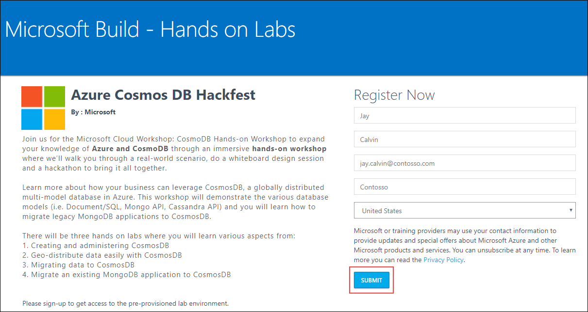
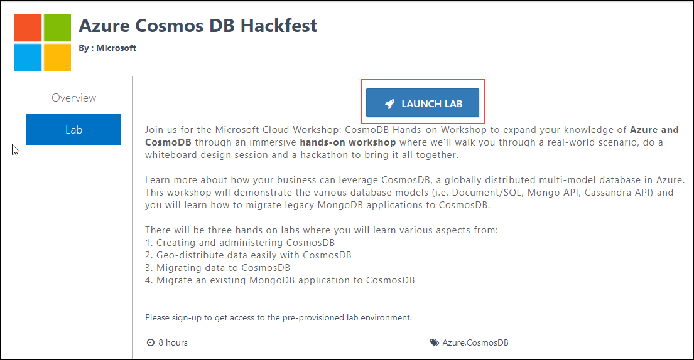
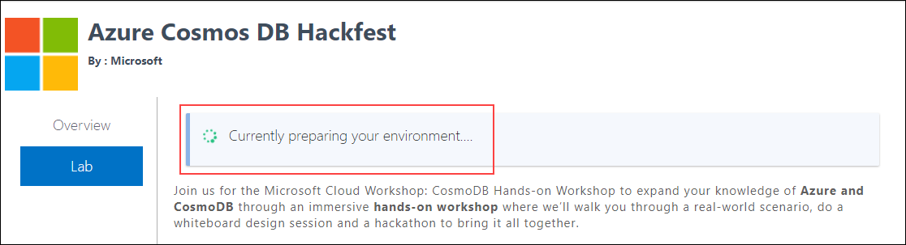
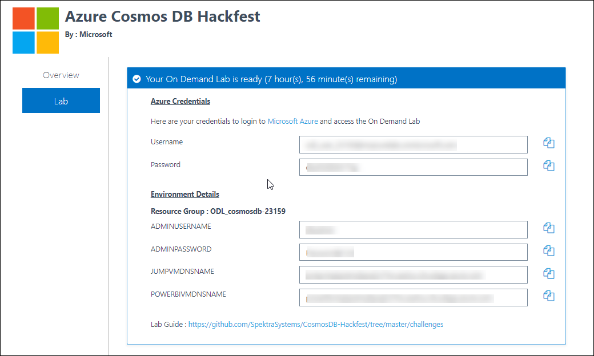
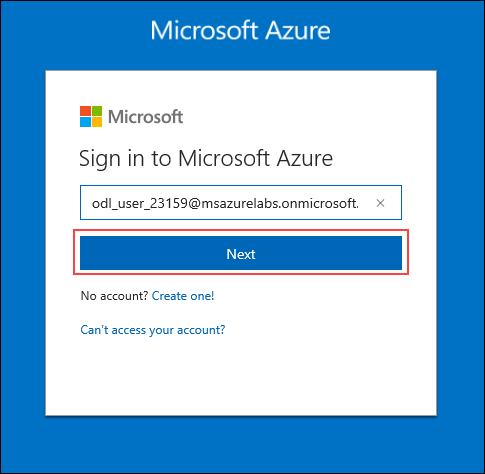
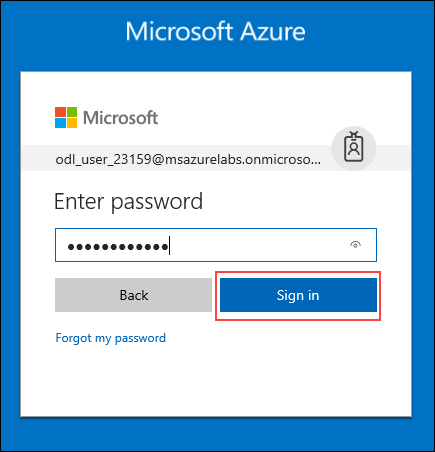
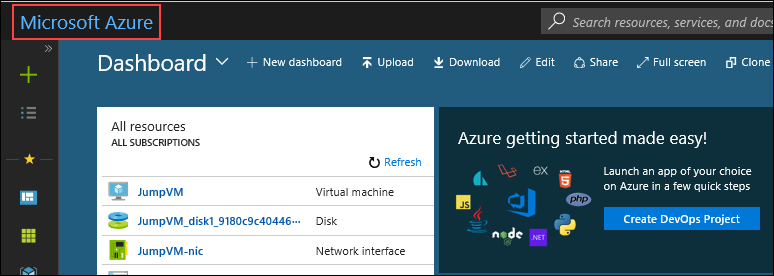
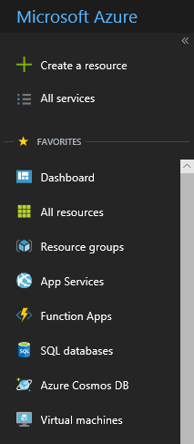
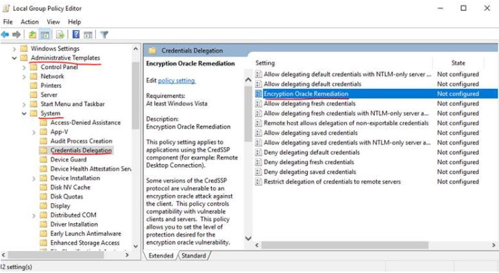
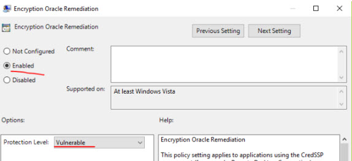

# CosmosDB-Hackfest
## Lab 1: Getting Started with Azure
### Lab Overview
In this lab, you will be deploying pre-requisite infrastructure which is required for CosmosDB Hackfest.
#### Time Estimate
45 minutes
#### Prerequisites
In the begining of the lab, instructor will provide the attendees with a http://bit.ly/ or http://aka.ms/ URL, using which the attendees can activate a pre-deployed lab instance and following are the steps.
1.  **Navigate** to the the url provided by the instructor to register for the lab.  
2.  Enter the following details to register for the lab:  
      *  **First Name**: Jay    
      *  **Last Name**: Calvin    
      *  **Work email**:  jay.calvin@contosso.com
      *  **Organization**:  Contosso
      *  **Country**:  United States
      
      **Click** on **SUBMIT** after entering the above details.
      
          
 
 3.  On clicking **SUBMIT**, you will be redirected to the following page. Click on the **LAUNCH LAB** button to start the deployment.  
 
        
        
4. On clicking the **LAUNCH LAB** Button, you will get the following message.  

         

5. When the deployment is completed, the following details will be displayed. Use the following details to proceed further into the lab.    

       

### Exercise 1: Log into your Azure Portal
In this exercise, you will log into the Azure Portal using your Azure credentials.
1.  **Navigate** to https://portal.azure.com and login (from the previous step).
2.  **Enter** the **Username** which was displayed in the previous window and **click** on **Next**.    

       

3.  **Enter** the **Password** and click on **Sign in**.  

      

4.  You will now be logged in to the azure portal.  

      

### Exercise 2: Verify access to the Subscription
In this exercise, you will verify the type of role you are assigned in this Subscription.  

1.	**Launch** a browser and **Navigate** to https://portal.azure.com. Login with your **Microsoft Azure** credentials.  

        

2. Click on **Microsoft Azure**  at the top left corner of the screen, to view the Dashboard.  

        
     
3. **Click** on the **Resource groups** button in the **Menu navigation** bar to view the Resource groups blade.  

        
     
4. You will see one Resource Groups on which you have access. Click on Resource Group which contains the pre-deployed on-premises infrastructure then click on **Overview** tab and finally on **JumpVM**.    

      
     
 ### Exercise 3: Resolve SSP Oracle Credential Issue
Due to recent change, you might get the following issue in rdp connection.
* An authentication error has occurred.
  The function requested is not supported.  
  This could be due to CredSSP encryption oracle remediation.
  For more information, see https://go.microsoft.com/fwlink/?linkid=866660
  
     
  
## Following is fix for this: 
* You can run the following dos command to make change in in registry setting
    > REG  ADD HKLM\Software\Microsoft\Windows\CurrentVersion\Policies\System\CredSSP\Parameters\ /v AllowEncryptionOracle /t REG_DWORD /d 2
    
* You can read more about this at https://blogs.technet.microsoft.com/mckittrick/unable-to-rdp-to-virtual-machine-credssp-encryption-oracle-remediation/

* If you cannot RDP to  VMs from your patched client, we can consider changing the policy settings on the client to temporarily gain RDP access to the servers. You can change the settings in Local Group Policy Editor. Execute gpedit.msc and browse to Computer Configuration / Administrative Templates / System / Credentials Delegation in the left pane:
  
 
* Change the Encryption Oracle Remediation policy to Enabled, and Protection Level to Vulnerable:
   

    > Note If you get error while connecting at first login: Click OK and try again.
