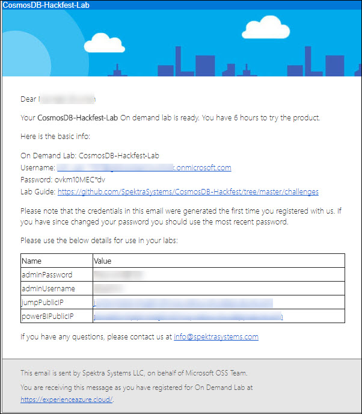
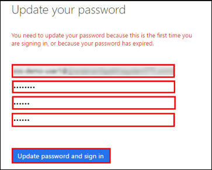
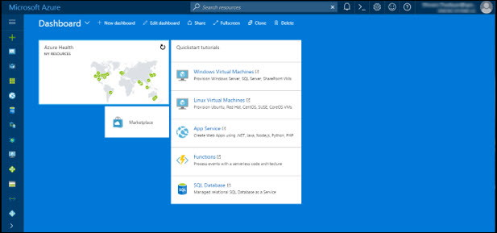
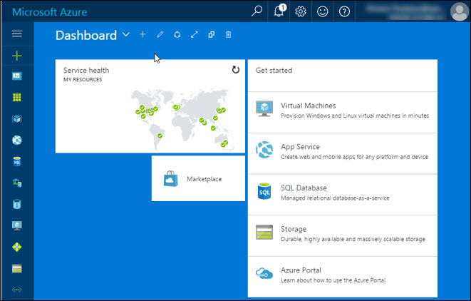

# CosmosDB-Hackfest
## Lab 1: Getting Started with Azure
### Lab Overview
In this lab, you will be deploying pre-requisite infrastructure which is required for CosmosDB Hackfest.
#### Prerequisites
* Windows or a Mac machine with HTML5 supported browser such as Microsoft Edge, Internet Explorer, Chrome or Firefox.
* You should have registered in the training portal https://azuretraining.spektrasystems.com and received the confirmation message with the credentials to login to the Azure portal.
* You will need Remote Desktop Connection (RDP) access. If you are using Mac, follow these details for installation: [Install Microsoft RDP on Mac](https://docs.microsoft.com/en-us/windows-server/remote/remote-desktop-services/clients/remote-desktop-mac)

 
#### Time Estimate
45 minutes

### Exercise 1: Log into your Azure Portal
In this exercise, you will log into the Azure Portal using your Azure credentials.
1.	**Navigate** to https://portal.azure.com and login (from the previous step).
2. Enter a new **password**. Then select **Update password and sign in**.

 
3. Now, you will be directed to the Azure Dashboard.

 

### Exercise 2: Verify access to the Subscription
In this exercise, you will verify the type of role you are assigned in this Subscription.
1.	**Launch** a browser and **Navigate** to https://portal.azure.com. Login with your **Microsoft Azure** credentials.

 
2. Click on **Microsoft Azure**  at the top left corner of the screen, to view the Dashboard.
 
3. To toggle **show/hide** the Portal menu options with icon, **Click** on the **Show Menu** button.
 
4. **Click** on the **Resource groups** button in the **Menu navigation** bar to view the Resource groups blade.
 
5. You will see one Resource Groups on which you have access. Click on Resource Group which contains the pre-deployed on-premises infrastructure then click on **Overview** tab and finally on **JumpVM**.
 

    > Note If you get err:connecting at first login: Click OK and try again.
