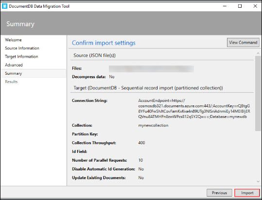
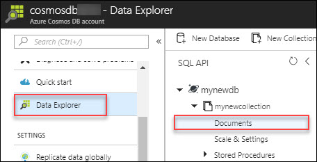
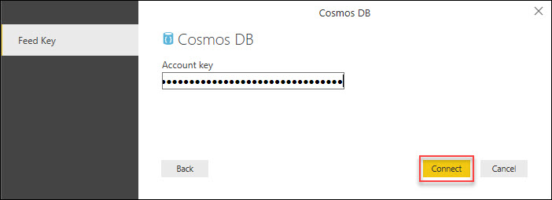

# Lab1: Introduction to Cosmos DB
## 1.	Introduction to Azure Cosmos DB

### 1.1	Create Cosmos DB Account with SQL API
1.	**Launch** a browser and **navigate** to https://portal.azure.com. **Login** with your Microsoft Azure credentials.<br/>
2.	To toggle show/hide the Portal menu options with icon, Click on the **Show Menu** button.<br/>     
<br/>
3.	Click on the **New** icon in the Menu navigation bar.<br/>
<br/>
4.	Type “**Cosmos db**” in the search box in the new blade that appears.<br/>
 <br/>
5.	Click on **Azure Cosmos DB** from the list that appears.<br/>
<br/>
6.	Click on Create in the **Azure Cosmos DB** blade.<br/>
<br/>
7.	Provide the following details in the Add directory blade.<br/>
    -	ID : Provide any unique name.
    -	API : **SQL** 
    -	Resource group : Select **Use Existing** resource group. <br/>
    -   Location: Canada East, or Canada Central (this should automatically fill when you choose resource group, leave as it is)
    -   Enable geo-redundancy</br>
Now, Click on **Create**.<br/>
<br/>
8.	After completion (5-10min) a notification will be raised as below.<br/>
<br/>
### 1.2	Create new DB and collection
1.  **Launch** a browser and **navigate** to https://portal.azure.com. **Login** with your Microsoft Azure credentials.<br/>
2.  Click on the **Resource Group** icon on the **Menu navigation bar**.<br/>
<br/>
3.  Now in the **Resource Groups** blade that appear, select the resource group for cosmos DB, (i.e, **odl-cosmosdb-hackfest**).<br/>
<br/>
4.  Then click on the created Azure Cosmos DB account(i.e,cosmosdb321).<br/>
<br/>
5.	In the Azure Cosmos DB account blade that appear, Click on **Overview**.<br/>
<br/>
6.  Click on **+Add Collection**.<br/> 
<br/>
7.  provide the following details in the Add Collection blade that appears.<br/>
    - Database id : Type a new database id
    - Collection id : Type a new collection id
    - Storage Capacity : **Fixed(10 GB)**
    - Throughput : **1000**<br/>
    Click on **OK**.<br/>
<br/>    
### 1.3	Load the Data in to  Cosmos DB.
#### 1.3.1	Access Windows VM and Launch Data migration tool.

1.  **Launch** a browser and **navigate** to https://portal.azure.com. **Login** with your Microsoft Azure credentials.<br/>
2.  Click on the **Virtual Machines** icon on the **Menu navigation bar**.<br/>
<br/>
3.  Click on the **Powerbivm**<br/>
<br/>
4.  Click on **Connect** button. On clicking on Connect, the rdp file automatically gets downloaded. Open the downloaded file.<br/>
<br/>
5.  After Opening **RDP** file. In the remote desktop window that pops up, Click on **Connect**.<br/>
<bbr/>
6.  Now go to the Lab details page, which you have recieved after launching the lab. Copy the VMs **username** and **password** and enter into Enter your credentials page. Click on **OK**<br/>
<br/>
7.  Click on **Yes** in the pop up window.<br/>
<br/>
8.  You'd have a pre-created windows virtual machine named PowerBI VM for you in your azure lab environment. Please access the virtual machine via remote desktop. DNS Name for the virtual machine is also available on the lab details page. <br/>
9. Download the sample data inside the **PowerBI VM** which we would migrate to cosmos DB by clicking [here](https://experienceazure.blob.core.windows.net/templates/cosmosdb/stocks/stocks.json) <br/>
  >Open the file to view the json data set.<br/>
10.  **Launch** your **data migration tool** by opening the **dtui** application (From Desktop).<br/>
<br/>   
11.  In the **DocumentDB Data Migration Tool** blade that appear, Click on **Next**.<br/>
<br/>   
12.  In the source information page that appear, select Import from **JSON file(s)** and click on **Add Files**.<br/>
<br/>   
13.  Select the downloaded file, **stocks.json** and click on open.<br/>
<br/>   
14.  Then in the **source information** page, click on **Next** and a Target information page will appear.<br/><br/>
15.  **Launch** a browser and **navigate** to https://portal.azure.com. **Login** with your Microsoft Azure credentials.<br/>
16.  Click on the **Resource Group** icon on the **Menu navigation bar**.<br/>
<br/>
17.  Now in the **Resource Groups** blade that appear, select the created resource group for cosmos DB, (i.e, **cosmosdb-rg**).<br/>
<br/>
18.  Then click on the created **Azure Cosmos DB account(i.e,cosmosdb321)**.<br/>
<br/>
19.  In the **Azure Cosmos DB account** blade, Click on **keys** menu under the **setting** tile.<br/>
<br/>   
20.  Then **copy** the **Primary Connection String** and paste the connection string in a notepad.<br/>
<br/>
21.  Now click on **Overview** menu in the **Azure Cosmos DB account** page and copy the newly created database name, i.e, mynewdb.<br/><br/>
22.  Now open the notepad and after the connection string add the text **Database=mynewdb**.<br/>
<br/>   
23.  Then go back to the **Target information** page of the Data migration tool and provide the following details.<br/>
       - Export to: **DocumentDB-Bulk import(Single partition collections)**.<br/>
       - Connection String: Copy the entire text from the notepad and paste it here.<br/>
    <br/>   
    After this Click on **Verify** button to verify the connection. Then a notification blade will pop-up which says **Successfully             connected to documentDB account**.In that notification blade click on **OK**. <br/>
    <br/>   
       - Collections: Enter the name of the new collection, (i.e, **mynewcollection**).  
    After this Click on **Add** button to add the collection.<br/>
    <br/>    
       - Collection throughput: Copy the collection **throughput** from the **overview** page of **Azure Cosmos DB account** and paste it here.<br/>
    Click on **Next** button.
    <br/>
    <br/>
24.  Then an **advanced** page will appear, in that click on **Next**.
     <br/>
25.  Then a Summary page will appear, in that click on **Import**.
     <br/>
26.  Now the import will start.It will take a couple of minutes to complete.
     <br/>
### 1.4	Use Data Explorer to interact with Cosmos DB database
#### 1.4.1	Verify Data in Azure Portal
1.  **Launch** a browser and **navigate** to https://portal.azure.com. **Login** with your Microsoft Azure credentials.<br/>
2.  Click on the **Resource Group** icon on the **Menu navigation bar**.<br/>
<br/>
3.  Now in the **Resource Groups** blade that appear, select the created resource group for cosmos DB, (i.e, **cosmosdb-rg**).<br/>
<br/>
4.  Then click on the created **Azure Cosmos DB account(i.e,cosmosdb321)**.<br/>
<br/>
5.  In the **Azure Cosmos DB account** blade that appear, Click on **Data Explorer**.<br/>
<br/>
6.  In the **Data Explorer page**, Expand **mynewdb** to view the collections.<br/>
<br/>
7.  Then expand **mynewcollection**.<br/> 
<br/>  
8.  Now click on **Documents** to view the data.<br/> 
<br/>  
9.  You can see the data by clicking the **IDs**.<br/>
<br/>  
#### 1.4.2  Query data
1.  In the **Azure Cosmos DB account** blade that appear, Click on **Query Explorer**.<br/>
<br/>
2.  In the page that appear, select the our **Database(mynewdb)** and **Collection(mynewcollection)**.<br/>
<br/>
3.  Now type your query based on the requirement in the provided space and click on **Run Query**.<br/>
```
For example: SELECT * FROM c  WHERE c.Sector= "Financial"
```
<br/>
4.  Now we can see all the data with **Sector = Financial**<br/>
<br/>


See this for more SQL Query examples: https://www.documentdb.com/sql/demo 
### 2.  Distribute Data Globally
   > Replication protects your data and preserves your application up-time in the event of transient hardware failures. If your data is replicated to a second data center, it's protected from a catastrophic failure in the primary location.
   
#### 2.1   Enable Database Replication 
1.  **Launch** a browser and **navigate** to https://portal.azure.com. **Login** with your Microsoft Azure credentials.<br/>
2.  Select the **Azure Cosmos DB account(i.e,cosmosdb321)**.<br/>
3.  In the Cosmos DB account page click on **Replicate data globally** tab under the **Settings** tile.<br/> 
<br/>
4.  In the new page that appear, click on **Add new region** under **Read regions**.<br/>
<br/>
5.  Now select the required **region** (say Central US) from the list and click on **OK**.<br/> 
<br/>
6.  If you want to add more regions, click on Add new region again and select the required region and click on **Save**.
<br/>
<br/>

   > - You can distribute your data to any number of Azure regions, with the click of a button. This enables you to put your data where your users are, ensuring the lowest possible latency to your customers.  
   > - Using Azure Cosmos DB's multi-homing APIs, the app always knows where the nearest region is and sends requests to the nearest data center. All of this is possible with no config changes. You set your write-region and as many read-regions as you want, and the rest is handled for you for more details click on given link [https://docs.microsoft.com/en-us/azure/cosmos-db/introduction](https://docs.microsoft.com/en-us/azure/cosmos-db/introduction)
   
 #### 2.2  Region Failover
 Cosmos DB supports both explicit and policy driven failovers that allow you to control the end-to-end system behavior in the event of failures.
 
 #### 2.3 Automatic Failover

   > - In the rare event of an **Azure regional outage**, **data center outage**, Cosmos DB automatically **triggers failovers** of all Cosmos DB accounts with a presence in the affected region.
   > - Cosmos DB accounts with a **read region** in one of the affected regions are automatically disconnected from their **write** region and **marked** offline.
   > - The **Cosmos DB SDK** implement a regional discovery protocol that allows them to automatically detect when a region is available and redirect read calls to the next available region in the **preferred region** list. If none of the regions in the preferred region list is available, calls automatically fall back to the current write region.
   > - Once the affected region recovers from the outage, all the affected Cosmos DB accounts in the region are automatically recovered by the service. Cosmos DB accounts that had a read region in the affected region will then automatically sync with current write region and turn **online**.
   > - The **Cosmos DB SDK** discover the availability of the new region and evaluate whether the region should be selected as the current read region based on the **preferred region list** configured by the application.

   > _Now let's see how to change priorities of preferred region list._

1. Now you should be at the **Replicate data globally** section from the previous step. Then click on **Automatic Failover** menu present on the top of the page.

   

1. If the affected region is the current write region and automatic failover is enabled for the **Azure Cosmos DB account**, then the region is automatically marked as **offline**. Then, an alternative region is promoted as the **write** region for the affected **Azure Cosmos DB account**.
1. Once you get redirected to **Automatic Failover** page, click **ON** button to enable automatic failover.
1. Drag-and-drop read regions items to reorder the failover priorities.

    

1. Click **OK** button to save the changes made.
1. Once the affected region recovers from the **outage**, all the affected Cosmos DB accounts in the region are automatically recovered by the service.

   > _Given is the concept of Automatic failover. Now let's dive into the concept of Manual failover._

#### 2.4 Manual Failover

1. In addition to **automatic failovers**, the current **write region** of a given Cosmos DB account can be manually changed dynamically to one of the existing **read regions**.
1. Manual failovers ensure  **zero data loss**  and  **zero availability loss** and gracefully transfer write status from the old write region to the new one for the specified Cosmos DB account.
1. Like in automatic failovers, the **Cosmos DB SDK** automatically handles write region changes during manual failovers and ensures that calls are automatically redirected to the new write region.
1. Navigate to **Azure Portal's** **Resource groups** option present in the favourites menu on the left side panel and select the resource group **"<inject story-id="story://Content-Private/content/dfd/SP-GDA/gdaexpericence1/story_a_gda_using_cosmosdb" key="myResourceGroupName"/>**" and click on Azure Cosmos DB Account **"<inject story-id="story://Content-Private/content/dfd/SP-GDA/gdaexpericence1/story_a_gda_using_cosmosdb" key="cosmosDBWithSQLDBName"/>"**.
1. Click on **Replicate data globally** option present under **Cosmos DB Account** blade. Then click on **Manual Failover** menu present on the top of page.

   

1. Once you get redirected to the **Manual failover** page, select a **Read Region** to change it into the new **Write** **Region**.
1. Click on checkbox  **I understand and agree to trigger a failover on my current Write Region** given below and click **OK** button to save the changes done.

   

1. If your applications have predictable traffic patterns based on the time of the day, you can periodically change the write status to the most active geographic region based on time of the day.

> _In this section we discovered how manual and automatic failovers work in Cosmos DB, and how you can configure your Cosmos DB accounts and applications to be globally available. By using Cosmos DB's global replication support, you can improve end-to-end latency and ensure that they are highly available even in the event of region failures._
 
### 3.  Cosmos DB Data Analysis with Cosmos 
#### 3.1 Add Cosmos DB as data Source
1. Access Windows VM and Run **Power BI Desktop** application available on desktop.
2. Once Power BI Desktop is launched, a Welcome screen is displayed. Provide the information and Click on **Done**.
<br/>
3. The Report view of Power BI Desktop is displayed. Select the **Home** ribbon, then click on **Get Data**. The Get Data window should appear.
<br/>
4. **Click** on Azure, select Azure Cosmos DB (Beta), and then click **Connect**. 
<br/>
5. On the Preview Connector page, click **Continue**. The Azure Cosmos DB Connect window appears.
<br/>
6. Specify the Cosmos DB account endpoint URL you would like to retrieve the data from as shown below, and Click **OK**.
<br/>
    - Leave the database name, collection name, and SQL statement blank as these fields are optional. Instead, we will use the Navigator to,select the Database and Collection to identify where the data comes from.

7. To use your own account, you can retrieve the URL from the URI box in the Keys blade of the Azure portal.
<br/>
8. If you are connecting to this endpoint for the first time, you are prompted for the account key. For your own account, retrieve the key from the Primary Key box in the Read-only Keys blade of the Azure portal.
<br/>
9. When the account is successfully connected, the Navigator will appear. The **Navigator** will show a list of databases under the account.
<br/>
10. **Click** and expand on the database where the data for the report will come from, select **mynewdb**. 
11. Now, select a collection that you will retrieve the data from. Here, we select **mynewcollection** created in above stop.
    The Preview pane shows a list of Record items. A Document is represented as a Record type in Power BI. Similarly, a nested       JSON block inside a document is also a Record.
    <br/>
12. **Click** Edit to launch the Query Editor in a new window to transform the data.
#### 3.2 Flattening, transforming JSON documents and developing dashboards
1. Switch to the Power BI Query Editor window, where the Document column in the center pane. 
<br/>
2. **Click** on the expander at the right side of the Document column header. The context menu with a list of fields will appear. Select the fields you need for your report, for instance, id, Ticker, Profit Margin, Institutional Owership, Sector, Shares Outstanding and then click **OK**.<br/>
<br/>
3. The center pane will display a preview of the result with the fields selected.
<br/>
4. **Click** Close and Apply to save the data model.
5. The following shows the basic steps of creating a simple interactive Pie Chart view report.
* For our example, we will create a pie chart view showing the document sector and the count of Shares Outstanding for each sector. In the Visualizations pane, click on the pie chart visual type as highlighted in the screenshot above.
<br/>
* Now, drag and drop the column on the right side "Document.Shares Outstanding" field from the Fields pane to the Values   Visualizations pane.
* Next, drag and drop the Document.Sector field to the Legend property.
* You should now see the Pie Chart showing different sectors in relational to the Count of Shares Outstanding values.
<br/>
* You now have created a basic report. You can further customize the report by adding more visualizations.
