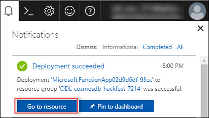
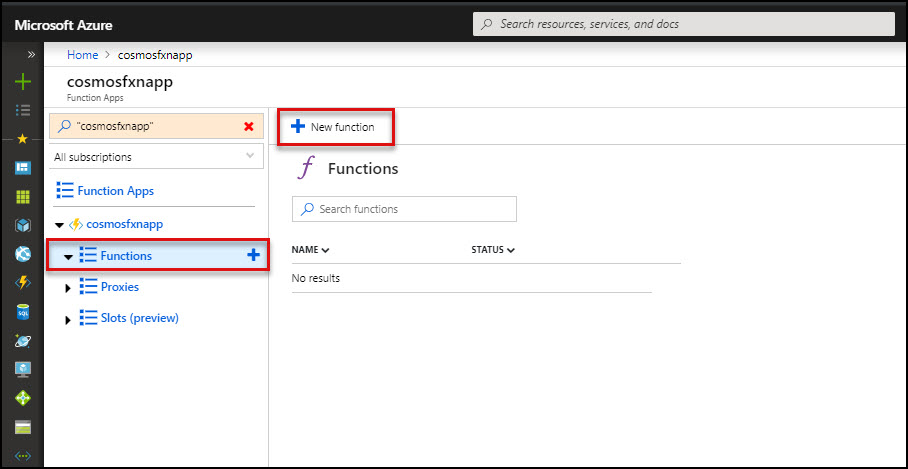
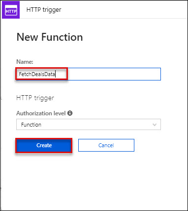

# Module 3: Migrate MongoDB Application to Azure Cosmos DB(SQL API) 
## Scenario 1 Access Cosmos DB account with SQL API (created in Module 1)
1. **Launch** a **browser** and navigate to https://portal.azure.com. **Login** with your **Microsoft Azure** credentials.<br/>
2. **Click** on **Resource Group** provided which contains the all the resources, click on created **Azure Cosmos DB account**(with SQL API, this is the first CosmosDB instance you created in challenge 1) under **Overview** tab.<br/>
<br/>
3. **Click** on **Keys** option present under Cosmos DB Account blade, and copy **URI** and **PRIMARY KEY**.<br/>
<br/>
4. **Go** back to **Visual Studio Code** IDE and paste the **URI** value against **DOCUMENT_DB_ENDPOINT**, **PRIMARY KEY** against **DOCUMENT_DB_PRIMARYKEY**, The original database name you created (under overview tab) against **DOCUMENT_DB_DATABASE** and change the **API_MODE** to **SQL** in the **config.js**.<br/>

5. **Navigate** back to the Azure Portal's Resource groups option present in the favourites menu on the left side panel and select the **resource group** and click on **Azure Cosmos DB Account** then, click on **Replicate data globally** option present under **SETTINGS** section in **Cosmos DB Account** blade.<br/>

6. Copy the **WRITE REGION** and paste it against **DOCUMENT_DB_PREFERRED_REGION** in **config.js** file which is already opened in **Visual Studio Code** IDE and save this file.<br/>
<br/>
7. **Go** to /home/CosmosDB-Hackfest/ContosoAir/src/ContosoAir.Services in file system, right click and select **Open Terimal Here** as shown below:<br/>
<br/>
8. Now execute the following commands one by one in command prompt.<br/>

```bash
node sql_db_flightinsert.js
node sql_db_insert.js
```
When this is completed, go back to the terminal that is running the API-tier (this is where you ran the npm start command) and enter the following:
```
ctrl+c
npm start
```

<br/>

9. Now, to start the **ContosoAir Website** layer, go to /home/CosmosDB-Hackfest/ContosoAir/src/ContosoAir.Website. Open terminal from there and run **ng serve** command in terminal. Minimize the terminal once command is executed, do not exit or CTRL+C.<br/>

```bash
ng serve
```
<br/>

10. It will create three different collections named **SeatsCollection**, **DealsCollection** and **BookingsCollection** with sample data.<br/>

11. Switch to **Azure Portal**, navigate to **Resource groups** option present in the favourites menu on the left side panel and select the resource group then click on **Azure Cosmos DB Account** named.<br/>

12. **Click** on **Data Explorer** option. It will display the collection created in **Azure Cosmos DB Account**.<br/>
<br/>

## Launch the Application
1. Copy the **localhost URL** [http://localhost:4200](http://localhost:4200) from **here** and paste it in **Web Browser** and press enter. There's a shortcut created for your already on desktop for this, you can open website using that as well.<br/>
1. You will see the **sign-up** page. You need to **login** to App using your **Microsoft Account**(formerly live-id). If you do not have a live-id, you can create one by following instructions given on page.<br/>
<br/>
1. Once you get login, you will be redirected to **ContosoAir app**.<br/>
<br/>
1. Enter **Departure date** and **Return date** in **YYYY-MM-DD** format and click **Find Flights** button.<br/>
<br/>


## Scenario 2: Integration with Azure Functions

### Create an Azure Function App
In this we will create Azure Function App.<br/>
1. **Login** to **Azure portal** with your credentials and Click on **+New**.<br/>
2. Search for **Function App**.<br/>
<br/>
3. **Click** on **Create**.<br/>
<br/>
4. Provide the parameters to create Function App as defined below.<br/>
*	**App Name**: Your unique name to identify the application
*	**Subscription**: Leave default
*	**Resource Group**: Choose Use Existing and select your available resource group
*	**OS**: Windows
*	**Hosting Plan**: Consumption Plan
*	**Location**: Location of your RG
*   **Runtime Stack**: **.Net**
*	**Storage**: Click on **Create new**<br/>
*   **Application Insight**: **Disable** application insight
<br/>
 Click on **Create**.<br/>
 <br/>
5. Click on **Go to Resource** Once provisioning is completed.<br/>
<br/>

### Create a function with Deal Data

  > _Let's create an Azure Function to retrieve data of flight deals._

1. Go to **Resource groups** option present in the favourites menu on the left side panel and select the resource group **<inject story-id="story://Content-Private/content/dfd/SP-GDA/gdaexpericence1/story_a_gda_using_cosmosdb" key="myResourceGroupName"/>** and click on Azure Function named **<inject story-id="story://Content-Private/content/dfd/SP-GDA/gdaexpericence1/story_a_gda_using_cosmosdb" key="azureFunctionName"/>**.<br/>
2. However over the **Functions** under **Functions Apps** and click on **+ sign** besides **Functions**.<br/>
3. Now, click on the **Custom function** link present at the bottom of the page.<br/>
<br/>
4. Click on template available in **HTTP trigger** section and name the function as "**FetchDealsData**" in **Name** textbox and click **Create** button.<br/>
<br/>
<br/>
5. A function with sample default code would get created. Now, replace the sample default code with the code snippet given below.<br/>

    ```c#
    using System.Net;
    using System.Linq;

    public static HttpResponseMessage Run(HttpRequestMessage req, TraceWriter log, IEnumerable<dynamic> SelectDealsData)
    {
        return req.CreateResponse(HttpStatusCode.OK, SelectDealsData);
    }
    ```

    > **NOTE:**
    > In above code snippet, **IEnumerable&lt;dynamic> SelectDealsData** is a parameter used to fetch the list of **DealsData** collection from Cosmos DB. This method returns the result fetched from Cosmos DB along with **HttpStatusCode** with the help of **CreateResponse** method.<br/>
6. Click on **Save** button.<br/>
7. Now, click on the **Integrate** option listed in **"FetchDealsData"** function in the **Function Apps** blade.<br/>
8. Under **Inputs** section, click on **+ New Input** and select **Azure Cosmos DB** then click **Select** button at the bottom of page.<br/>
<br/>
8. Enter **Document parameter name** as **SelectDealsData**, **Database name** as **contosoairdb3** and **Collection name** as **DealsCollection** in respective textboxes.<br/>
9. Copy the **SQL query** given below and paste it into **SQL Query (optional)** textbox.<br/>

    ```sql
   select c.id, c.fromName, c.fromCode, c.toName, c.toCode, c.price, c.departTime, c.arrivalTime, c.hours, c.stops, c.since from c
    ```

    > **NOTE:** Above **SQL query** is responsible to get deals details from **DealsCollection** available in Cosmos DB like id, from name, from code, to name, to code, price, depart time, arrival time, hours, stops, since. (Ignore non-mandatory fields)

    
    
10. To enter **Cosmos DB account connection,** click on the **new** link given beside **Cosmos DB account connection** textbox.<br/>
<br/>
11. You will be redirected to **Cosmos DB Account blade**, select the **MongoDB DB Account** as shown below.<br/>
<br/>
12. Now, go to **FetchDealsData** and click on **Save** button  button.<br/>
13. To check whether the function is integrated, click on **FetchDealsData** function present under **AureFunctionForDeals** function app blade and click on **Test** option present at the right most corner.<br/>
<br/>
14. Select **HTTP method** as **GET** from the dropdown. Then click **Run** button at the bottom.
<br/>
15. Status **200 Ok** will be displayed once the test is completed which signifies that the function is integrated successfully.<br/>
<br/>

   > _Here you go! You have successfully created Azure Function to_ _retrieve flight deals_ _data from_ **Cosmos DB**_._

16. In the **Functions Apps** blade, click on **FetchDealsData**.<br/>
17. You will get navigated to function and will find **</> Get function URL** link in the top right corner of the page. Click on the link <br/>
18. On clicking **</> Get function URL** you will get a popup window with a URL.<br/>
 <br/>
19. Click on **Copy**  icon to copy the given URL and paste it against **AZURE\_FUNCTION\_DEALS\_URL:** variable in **config.js file** opened in **Visual Studio Code** IDE and save the file.

   > _Awesome, you have created Azure Function for Deals data and integrated with Cosmos DB._
