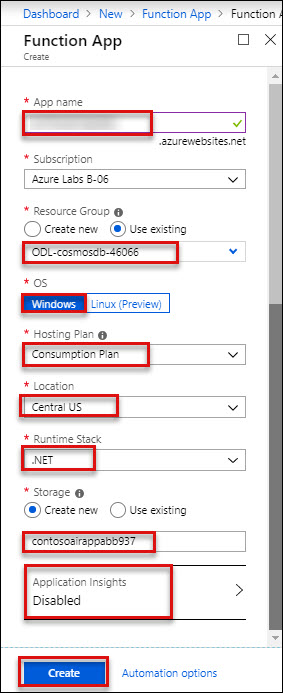
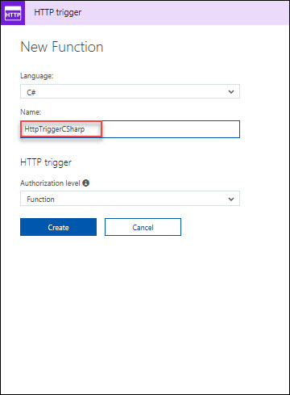
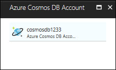

# Module 4: Integration with Azure Functions(SQL API) 

## Scenario 1: Create an Azure Function App
In this we will create Azure Function App.<br/>
1. **Login** to **Azure portal** with your credentials and Click on **+New**.<br/>
2. Search for **Function App**.<br/>
<br/>
3. **Click** on **Create**.<br/>
<br/>
4. Provide the parameters to create Function App as defined below.<br/>
*	**App Name**: Your unique name to identify the application
*	**Subscription**: Leave default
*	**Resource Group**: Choose Use Existing and select your available resource group
*	**OS**: Windows
*	**Hosting Plan**: Consumption Plan
*	**Location**: Location of your RG
*	**Storage**: Click on **Create new**<br/>
    Click on **Create**.<br/>
    <br/>
5. Click on **Go to Resource** Once provisioning is completed.<br/>
<br/>

### Create a function

  > _Let's create an Azure Function to retrieve data of flight deals._

1. Go to **Resource groups** option present in the favourites menu on the left side panel and select the resource group **<inject story-id="story://Content-Private/content/dfd/SP-GDA/gdaexpericence1/story_a_gda_using_cosmosdb" key="myResourceGroupName"/>** and click on Azure Function named **<inject story-id="story://Content-Private/content/dfd/SP-GDA/gdaexpericence1/story_a_gda_using_cosmosdb" key="azureFunctionName"/>**.<br/>
2. However over the **Functions** under **Functions Apps** and click on **+ sign** besides **Functions**.<br/>
3. Now, click on the **Custom function** link present at the bottom of the page.<br/>
<br/>
4. Click on **C#** template available in **HTTP trigger** section and name the function as "**HttpTriggerCSharp**" in **Name** textbox and click **Create** button.<br/>
<br/>
<br/>
5. A function with sample default code would get created. Now, replace the sample default code with the code snippet given below.<br/>

    ```c#
    using System.Net;
    using System.Linq;

    public static HttpResponseMessage Run(HttpRequestMessage req, TraceWriter log, IEnumerable<dynamic> Financial)
    {
        return req.CreateResponse(HttpStatusCode.OK, Financial);
    }
    ```

    > **NOTE:**
    > In above code snippet, **IEnumerable&lt;dynamic> Financial** is a parameter used to fetch the list of **Sector** collection from Cosmos DB. This method returns the result fetched from Cosmos DB along with **HttpStatusCode** with the help of **CreateResponse** method.<br/>
6. Click on **Save** button.<br/>
7. Now, click on the **Integrate** option listed in **"HttpTriggerCSharp"** function in the **Function Apps** blade.<br/>
8. Under **Inputs** section, click on **+ New Input** and select **Azure Cosmos DB** then click **Select** button at the bottom of page.<br/>
<br/>
8. Enter **Document parameter name** as **Financial**, **Database name** as **mynewdb** and **Collection name** as **mynewcollection** in respective textboxes.<br/>
9. Copy the **SQL query** given below and paste it into **SQL Query (optional)** textbox.<br/>

    ```sql
   select c.id, c.Sector, c.Country, c.Change from c
    ```

    > **NOTE:** Above **SQL query** is responsible to get details from **mynewcollection** available in Cosmos DB (Ignore non-mandatory fields)

    
    
10. To enter **Cosmos DB account connection,** click on the **new** link given beside **Cosmos DB account connection** textbox.<br/>
<br/>
11. You will be redirected to **Cosmos DB Account blade**, select the **MongoDB DB Account** as shown below.<br/>
<br/>
12. Now, go to **HttpTriggerCSharp** and click on **Save** button  button.<br/>
13. To check whether the function is integrated, click on **HttpTriggerCSharp** function present under **AureFunctionForDeals** function app blade and click on **Test** option present at the right most corner.<br/>
<br/>
14. Select **HTTP method** as **GET** from the dropdown. Then click **Run** button at the bottom.<br/>
15. Status **200 Ok** will be displayed once the test is completed which signifies that the function is integrated successfully.<br/>
<br/>

   > _Here you go! You have successfully created Azure Function to_ _retrieve flight deals_ _data from_ **Cosmos DB**_._
